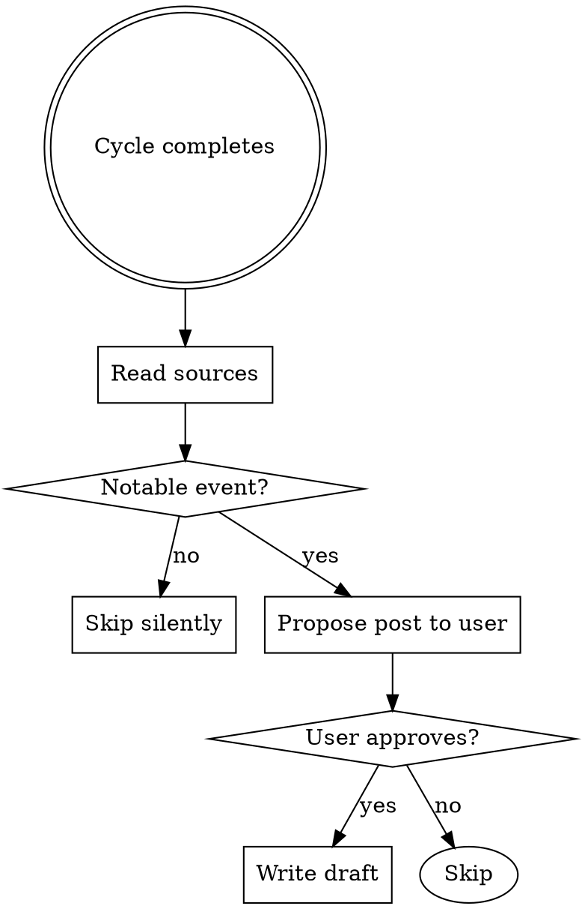

# Prompt Diary

## Overview

After each 수정/추가 cycle completes, check if the cycle contained a notable prompt event. If yes, propose and write a `blog/prompt-diary/` post. If no, skip silently.

## What Counts as Notable

A prompt event is notable if **any one** of these is true:

- A specific command or prompt input led to a surprising or instructive result
- An AI behavior triggered a workflow change (new CLAUDE.md rule, new pattern adopted)
- An assumption was wrong and the correction is reusable learning
- A technique was used for the first time (new skill, new GSD command, new pattern)

NOT notable: routine implementation cycles where AI just wrote code as expected with no surprises.

## Process



### Step 1 — Read Sources

Check these in order (stop when you have enough context):

1. `.claude/dev-log/YYYY-MM-DD.log` — today's file changes (today = current date)
2. `git log --oneline -10` — recent commits
3. `docs/phase-status.md` — what cycle just completed

### Step 2 — Judge

Apply the notable criteria above. If none apply, output nothing and stop.

### Step 3 — Propose

If notable, output a single proposal block:

```
[프롬프트 일기 제안]
편번호: #N  (다음 미사용 번호)
파일명: draft-{N}-{주제}.md
주제: {한 줄 설명}
핵심 이벤트: {어떤 프롬프트 → 어떤 결과 → 어떤 결정}
작성할까요? (y/n)
```

### Step 4 — Write (only if approved)

Write to `blog/prompt-diary/draft-{N}-{주제}.md` using this structure:

```markdown
# [프롬프트 일기 #{N}] {제목}

---

## 이 시점의 게임


*이전 포스트 이후 추가된 기능을 한 줄로. 이 사이클 직전의 게임 상태.*

---

## 그날 상황
{컨텍스트: 무슨 작업을 하고 있었나}

---

## 입력한 프롬프트
{사용한 커맨드/프롬프트 — 실제 텍스트 인용}

---

## 뭐가 나왔나
{AI 반응 및 결과물}

---

## 그래서 어떤 결정을 했나
{결과로 생긴 변화: 코드, CLAUDE.md, 워크플로우 등}

---

## 한 줄 회고
{이 이벤트의 핵심 교훈 한 줄}
```

## Style Rules

- 톤: 개발일지. 매끄럽게 정제하지 말 것. 실패·결정 순간 포함.
- 언어: 한국어
- 단위: 프롬프트 이벤트 하나 = 포스트 하나 (한 사이클에 여러 이벤트가 있으면 가장 핵심적인 것 하나만)
- 프롬프트 인용: 코드 블록(`>` 인용) 사용, 핵심만
- 코드 리뷰 디테일 X — 어떤 프롬프트를 어떻게 썼는지가 중심

## Episode Number

Find the highest existing number in `blog/prompt-diary/` and add 1.
